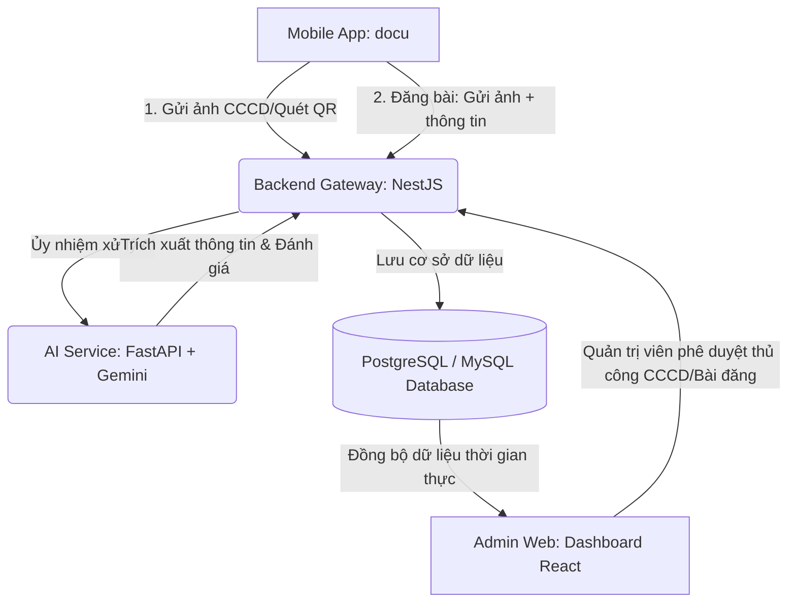

# HỆ THỐNG NGHIÊN CỨU KHOA HỌC (NCKH) - TDC EXCHANGE
## Tổng Hợp Top 5 Tính Năng Giá Trị & Mang Tính Nghiên Cứu Nhất Hệ Thống

Tài liệu này tổng hợp toàn bộ các tính năng cốt lõi, mang tính chất nghiên cứu khoa học (NCKH), kỹ thuật lập trình nâng cao và thực tiễn cao nhất trên toàn hệ sinh thái dự án **TDC Exchange** (bao gồm ứng dụng di động `docu` - React Native/Expo, ứng dụng quản trị `admin-web` - React Vite, server trung gian `backend` - NestJS và dịch vụ trí tuệ nhân tạo `ai-service` - FastAPI/Gemini).

---

### BẢN ĐỒ KIẾN TRÚC TÍCH HỢP HỆ THỐNG

---

### TOP 1: Hệ thống Định giá & Viết mô tả đa phương thức thông minh (Multimodal Price Suggestion & SEO Content Generation)
* **Vị trí code liên quan:**
  * AI Service: [/services/gemini_service.py](file:///d:/DuAn01/AppDoCu/ai-service/services/gemini_service.py) & [/main.py](file:///d:/DuAn01/AppDoCu/ai-service/main.py#L111-L164)
  * Backend Gateway: [ai.service.ts](file:///d:/DuAn01/AppDoCu/backend/deadcells/src/ai/ai.service.ts#L67-L101) & [ai.controller.ts](file:///d:/DuAn01/AppDoCu/backend/deadcells/src/ai/ai.controller.ts#L30-L38)
  * Mobile App: [PostFormScreen.tsx](file:///d:/DuAn01/AppDoCu/docu/screens/post/PostFormScreen.tsx)

#### 💡 Mô tả tính năng
Khi sinh viên đăng tin thanh lý đồ cũ, việc đặt giá bán quá cao hoặc quá thấp và viết mô tả tẻ nhạt thường làm giảm khả năng giao dịch. Hệ thống cho phép người dùng chụp/tải lên ảnh sản phẩm, chọn danh mục và tình trạng, sau đó bấm một nút để AI tự động:
1. **Định giá sản phẩm:** Đưa ra mức giá thanh lý tối ưu bằng VNĐ dựa trên nhận diện hình ảnh (thương hiệu, độ mới ngoại quan) phối hợp thông tin văn bản đầu vào.
2. **Tự động viết mô tả:** Sinh một đoạn văn quảng cáo hấp dẫn, thu hút người mua, chuẩn SEO, ngắn gọn bằng ngôn ngữ tiếng Việt tự nhiên và phù hợp với đối tượng sinh viên.

#### 🔬 Giá trị Nghiên cứu Khoa học (NCKH)
* **Xử lý Đa phương thức (Multimodal AI Processing):** Kết hợp đồng thời dữ liệu hình ảnh (Computer Vision) và dữ liệu văn bản (Natural Language Processing) thông qua mô hình lớn (Large Multimodal Models - Gemini Vision) để phân tích ngữ cảnh kinh tế.
* **Kỹ thuật Prompting & Post-processing nâng cao:** 
  * Áp dụng Prompt định hình hành vi chuyên gia (Sales Expert Roleplay) với các ràng buộc khắt khe về định dạng đầu ra.
  * Sử dụng Regex lọc và chuẩn hóa dữ liệu trả về từ AI (ép kiểu số nguyên VNĐ sạch, loại bỏ ký tự rác, lọc định dạng markdown) đảm bảo không làm gãy giao diện frontend.

---

### TOP 2: Luồng Xác thực số & Trích xuất mã QR trên CCCD (Digital Identity Verification via Heuristic Camera QR Parsing)
* **Vị trí code liên quan:**
  * Mobile App: [VerifyStudentScreen.tsx](file:///d:/DuAn01/AppDoCu/docu/screens/profile/VerifyStudentScreen.tsx#L53-L148)
  * Backend: [users.controller.ts](file:///d:/DuAn01/AppDoCu/backend/deadcells/src/users/users.controller.ts#L110-L237) & [users.service.ts](file:///d:/DuAn01/AppDoCu/backend/deadcells/src/users/users.service.ts#L81-L150)
  * Admin Web: [PendingCCCD.tsx](file:///d:/DuAn01/AppDoCu/admin-web/src/pages/PendingCCCD.tsx) (Hàng đợi phê duyệt)

#### 💡 Mô tả tính năng
Để xây dựng một thị trường mua bán đồ cũ an toàn trong môi trường học đường, việc ngăn chặn tài khoản ảo và lừa đảo là tối quan trọng. Hệ thống tích hợp tính năng xác thực danh tính sinh viên thông qua thẻ Căn cước công dân (CCCD):
1. Sinh viên quét mã QR trên CCCD vật lý bằng camera điện thoại.
2. Trích xuất tự động thông tin cá nhân cơ bản và chụp ảnh thẻ CCCD đối chiếu.
3. Chuyển thông tin về hàng đợi phê duyệt (Review Queue) tại Admin Web để quản trị viên đối khớp ảnh chụp thực tế và thông tin trích xuất trước khi chuyển trạng thái tài khoản thành Verified.

#### 🔬 Giá trị Nghiên cứu Khoa học (NCKH)
* **Thuật toán Phân tích Cú pháp Heuristic 3 lớp (3-tier Robust Heuristic Parsing):** Giải quyết vấn đề dữ liệu QR CCCD của Bộ Công An Việt Nam có định dạng chuỗi phân tách bằng dấu gạch đứng `|` nhưng đôi khi bị nhiễu hoặc sai lệch định dạng tùy loại đầu đọc. Mã nguồn tự động áp dụng 3 chiến lược giải mã tuần tự:
  1. *Lớp 1 (JSON parser)*: Thử giải mã nếu chuỗi là JSON.
  2. *Lớp 2 (Regex key-value)*: Quét tìm từ khóa chuẩn hóa không dấu (tiếng Việt).
  3. *Lớp 3 (Pipe-separated heuristic)*: Tìm phân đoạn ID bằng regex `^\d{9,15}$`, từ đó định vị họ tên và các trường ngày sinh, giới tính tương đối.
* **Quy trình Xác thực 2 bước (Two-Factor Identity Verification Workflow):** Kết hợp tự động hóa Client-side (quét nhanh QR) với xác thực con người Server-side (Admin so sánh thông tin trích xuất với ảnh chụp thẻ thực tế), đảm bảo tính pháp lý và giảm thiểu tối đa hành vi giả mạo thông tin.

---

### TOP 3: Tự động Kiểm duyệt Nội dung & Đánh giá Chất lượng Ảnh chụp (Auto-Moderation & Real-time Image Quality Assessment)
* **Vị trí code liên quan:**
  * AI Service: [/main.py](file:///d:/DuAn01/AppDoCu/ai-service/main.py#L62-L78) (Kiểm duyệt chữ) & [/main.py](file:///d:/DuAn01/AppDoCu/ai-service/main.py#L166-L223) (Kiểm duyệt ảnh)
  * Backend: [ai.service.ts](file:///d:/DuAn01/AppDoCu/backend/deadcells/src/ai/ai.service.ts#L31-L40) & [ai.service.ts](file:///d:/DuAn01/AppDoCu/backend/deadcells/src/ai/ai.service.ts#L103-L118)

#### 💡 Mô tả tính năng
Khi đăng bán sản phẩm, hệ thống áp dụng hai vòng kiểm duyệt tự động bằng AI trước khi đưa tin đăng lên trang chủ:
1. **Kiểm duyệt văn bản (Text Moderation):** Phát hiện từ ngữ thô tục, chửi thề, spam, lừa đảo, quảng cáo cờ bạc hoặc các nội dung cấm khác. Trả về nhãn phân loại `VI_PHAM` hoặc `AN_TOAN`.
2. **Phân tích chất lượng ảnh (Image Quality Analysis):** Đánh giá ảnh chụp dựa trên 7 tiêu chí khoa học (Độ sắc nét, Độ sáng/Tương phản, Độ nhiễu hạt, Bố cục vật thể trung tâm, Hậu cảnh lộn xộn, Độ khớp danh mục đăng tải, và Phát hiện ảnh tải trên mạng/Ảnh Stock). Trả về phân cấp ảnh (`Tốt`, `Khá/Mờ`, `Tệ`) kèm lý do chi tiết.

#### 🔬 Giá trị Nghiên cứu Khoa học (NCKH)
* **Hạn chế rác dữ liệu & Tối ưu dung lượng lưu trữ:** Bằng cách chặn hoặc cảnh báo người dùng ngay tại thời điểm tải ảnh lên nếu ảnh bị mờ hoặc chói, hệ thống giảm tải dung lượng băng thông và lưu trữ trên Cloud Storage.
* **Nhận diện ảnh mạng trái phép (Stock Image Detection):** Tăng độ tin cậy của bài đăng bằng cách yêu cầu người bán phải chụp ảnh thật của sản phẩm tại thời điểm hiện tại thay vì tải hình ảnh lung linh trên Internet, giảm thiểu tối đa rủi ro treo đầu dê bán thịt chó.

---

### TOP 4: Tìm kiếm ngữ nghĩa bằng Không gian Vector (Semantic Search via Vector Embeddings)
* **Vị trí code liên quan:**
  * AI Service: [/services/gemini_service.py](file:///d:/DuAn01/AppDoCu/ai-service/services/gemini_service.py) & [/main.py](file:///d:/DuAn01/AppDoCu/ai-service/main.py#L79-L108)
  * Backend: [ai.service.ts](file:///d:/DuAn01/AppDoCu/backend/deadcells/src/ai/ai.service.ts#L20-L29) & [ai.service.ts](file:///d:/DuAn01/AppDoCu/backend/deadcells/src/ai/ai.service.ts#L53-L65)

#### 💡 Mô tả tính năng
Thay vì tìm kiếm ký tự truyền thống (SQL `LIKE` hoặc Full-text Search) vốn chỉ khớp được các từ chính xác, hệ thống triển khai tìm kiếm ngữ nghĩa (Semantic Search). Người dùng có thể tìm các từ đồng nghĩa, viết tắt hoặc mô tả ý nghĩa, AI vẫn tính toán ra các sản phẩm phù hợp nhất.
Ví dụ: Tìm kiếm "phương tiện đi học" sẽ khớp ra các sản phẩm "xe đạp điện", "xe máy Wave Alpha". Tìm "máy tính học lập trình" sẽ đề xuất "MacBook Pro".

#### 🔬 Giá trị Nghiên cứu Khoa học (NCKH)
* **Không gian Vector & Hàm Cosine Similarity:**
  * Hệ thống chuyển đổi các mô tả và tiêu đề sản phẩm thành các vector số học nhiều chiều (Dense Vectors) bằng mô hình Text Embedding.
  * Khi người dùng nhập từ khóa tìm kiếm, từ khóa này cũng được vector hóa. Sau đó, hệ thống tính góc Cosine giữa vector truy vấn và danh sách vector sản phẩm để xếp hạng sự tương đồng ngữ nghĩa.
* Giải quyết triệt để hạn chế của tìm kiếm từ khóa thông thường, đưa hệ thống tiệm cận với các thuật toán tìm kiếm hiện đại của các trang thương mại điện tử lớn (Tiki, Shopee, Amazon).

---

### TOP 5: Kiến trúc Quản lý State Phân tán, Caching & Tối ưu hóa hiệu năng render DOM (Distributed State Store & High-performance DOM Optimization)
* **Vị trí code liên quan:**
  * Admin Web Store: [adminStore.ts](file:///d:/DuAn01/AppDoCu/admin-web/src/store/adminStore.ts)
  * Components hiển thị: [Products.tsx](file:///d:/DuAn01/AppDoCu/admin-web/src/pages/Products.tsx) & [Dashboard.tsx](file:///d:/DuAn01/AppDoCu/admin-web/src/pages/Dashboard.tsx)
  * Cấu hình biên: [/vercel.json](file:///d:/DuAn01/AppDoCu/admin-web/vercel.json)

#### 💡 Mô tả tính năng
Đối với trang quản trị `admin-web`, việc hiển thị các biểu đồ biến động phức tạp và danh sách sản phẩm lớn dễ dẫn đến hiện tượng nghẽn giao diện (UI Lag/Jank) và gọi API thừa thãi. Hệ thống được tối ưu hóa ở tầng ứng dụng và triển khai:
1. **Zustand State Caching:** Lưu trữ và chia sẻ trạng thái thống kê (KPIs, Biểu đồ Recharts, Danh sách hàng đợi) tập trung. Tránh tối đa hiện tượng "Prop Drilling" và Fetch trùng lặp khi người dùng chuyển đổi tab.
2. **Client-side Pagination:** Phân trang và kiểm soát số lượng phần tử render trên cây DOM (9 phần tử mỗi trang) giúp trình duyệt duy trì tốc độ phản hồi 60 FPS.
3. **Edge Rewrite Fallback Config:** Cấu hình chuyển hướng biên giúp ứng dụng Single Page Application (SPA) không bị lỗi 404 khi người dùng tải lại trang (F5 Reload) trên môi trường Server Cloud.

#### 🔬 Giá trị Nghiên cứu Khoa học (NCKH)
* **Tối ưu hóa tài nguyên mạng và CPU phía Client (Client-Side Resource Optimization):** Trực tiếp kiểm chứng các mô hình quản lý trạng thái hiện đại. Bằng cách giảm số lượng node trên DOM, trình duyệt giảm được 80% tài nguyên CPU để tính toán layout lại (Recalculate Style & Repaint).
* Nghiên cứu giải pháp thiết kế Single Page Application hoạt động ổn định trên môi trường Cloud Server không trạng thái (Serverless).

---

### BẢNG SO SÁNH TỔNG QUAN CÁC TÍNH NĂNG NCKH

| Tính Năng | Thành Phần Hệ Thống | Độ Phức Tạp Kỹ Thuật | Tính Nghiên Cứu | Lợi Ích Thực Tiễn |
| :--- | :--- | :--- | :--- | :--- |
| **Top 1: Định giá & Viết mô tả đa phương thức** | AI Service (FastAPI) + Backend (NestJS) + App Mobile | ⭐⭐⭐⭐⭐ (Rất cao) | ⭐⭐⭐⭐⭐ (Rất cao) | Giúp sinh viên đăng bài nhanh, tăng tỷ lệ chốt đơn nhờ AI gợi ý. |
| **Top 2: Xác thực số & Quét QR CCCD** | App Mobile (Camera) + Backend + Web Admin Dashboard | ⭐⭐⭐⭐ (Cao) | ⭐⭐⭐⭐ (Cao) | Chặn đứng tài khoản ảo và lừa đảo trong trường học. |
| **Top 3: Kiểm duyệt nội dung & Chất lượng ảnh** | AI Service (Gemini Vision) + Backend Gateway | ⭐⭐⭐⭐ (Cao) | ⭐⭐⭐⭐ (Cao) | Tiết kiệm bộ lưu trữ Cloud, giữ gìn môi trường trao đổi văn minh. |
| **Top 4: Tìm kiếm ngữ nghĩa bằng Vector** | AI Service (Embeddings) + Database Search Layer | ⭐⭐⭐⭐ (Cao) | ⭐⭐⭐⭐ (Cao) | Tăng trải nghiệm tìm kiếm thông minh, hiểu ý người dùng. |
| **Top 5: Caching & Tối ưu DOM** | Admin Web (Zustand + Recharts) + Edge Config | ⭐⭐⭐ (Vừa) | ⭐⭐⭐ (Vừa) | Hệ thống quản trị mượt mà, hạn chế lag giật khi tải dữ liệu lớn. |
