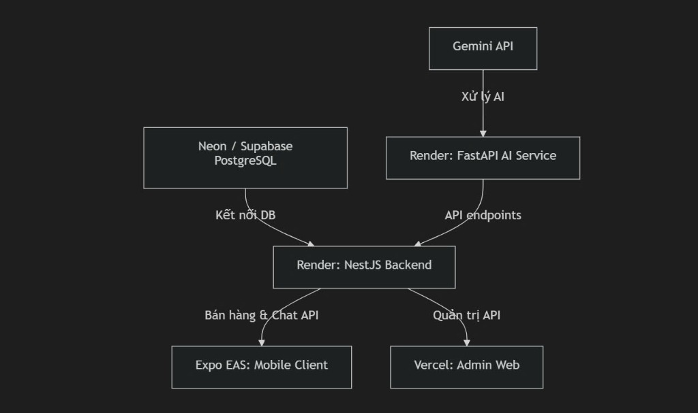

# 🌟 TDC Second-Hand Marketplace - AI-Integrated Student Used Goods Platform

**TDC Second-Hand Marketplace** is a comprehensive application ecosystem designed for students of **Thu Duc College of Technology (TDC)** to easily list, exchange, buy, sell, and donate used goods.

The platform's highlight is the integration of **Artificial Intelligence (AI)**, which automatically generates product descriptions, suggests optimal resale prices, moderates image quality, and categorizes items automatically based on a single photo upload.

---

## 🏗️ System Architecture

Below is the operational flow and connectivity diagram between the system's services:

<p align="center">
  
</p>

### Component Details:
1. **Gemini API (AI Engine):** The brain processing smart tasks (Generating descriptions, suggesting prices, analyzing image quality, moderating abusive/spam content, generating vector embeddings for advanced semantic search).
2. **FastAPI AI Service (Render):** A Python-based microservice acting as an intermediary to receive data from the Backend, communicate with the Gemini API, and respond quickly via API endpoints.
3. **NestJS Backend (Render):** The central server managing business logic, user authentication, APIs for trading, community groups, notifications, and Socket.io integration for real-time chat rooms.
4. **Neon / Supabase PostgreSQL:** Relational database storing products, accounts, messages, and transaction history.
5. **Expo EAS - Mobile Client (Mobile App):** A cross-platform (iOS/Android) mobile application for end users (students).
6. **Vercel - Admin Web (Admin Dashboard):** An intuitive web dashboard for administrators to moderate listings, reports, groups, and users.

---

## 🎨 Figma Design

Scan the QR code below to view the detailed UI/UX design on Figma:

<p align="left">
  
</p>

---

## 🚀 Key Features

- **🤖 AI-Powered Smart Posting:** Scan product images to automatically recognize categories, write SEO-friendly sales descriptions, and suggest the most suitable resale prices.
- **📸 Image Quality Moderation:** AI automatically evaluates sharpness, lighting, composition, and alerts users if it detects blurry, stock, or inappropriate photos.
- **💬 Real-time Chat:** Direct messaging between buyers and sellers with support for image attachments, location sharing, and stable Socket.io communication.
- **🔔 Instant Push Notifications:** Instant alerts for new messages, item views/interest, or community group activities.
- **👥 Community Exchange Groups:** Join or create trading groups by Faculty, Class, or Dormitory for more secure and trusted transactions.
- **🔍 Semantic Search:** Advanced search powered by Vector Embeddings to find products accurately based on user intent, even without exact keyword matches.
- **🛡️ Filters & Moderation:** Filter listings by price, location, condition, and integrated AI to automatically check posts for profanity or fraudulent content.
- **📊 Admin Dashboard:** Admin panel for statistics, user management, and handling user reports.

---

## 🛠️ Technology Stack

| Component | Main Technologies |
| :--- | :--- |
| **Mobile Client** | React Native, Expo SDK 54, TypeScript, NativeWind (Tailwind CSS), React Navigation, Lucide Icons |
| **Admin Web** | React 19, TypeScript, Vite, Tailwind CSS, Axios |
| **Backend API** | NestJS, TypeORM, PostgreSQL, Socket.io, Cloudinary (Image storage), Nodemailer |
| **AI Service** | Python, FastAPI, Gemini API (`google-generativeai`), Pillow, Uvicorn |
| **Database** | PostgreSQL (Hosted on Neon / Supabase) |

---

## 📂 Project Structure

```text
AppDoCu/
├── docu/                # Mobile application source code (React Native Expo)
├── backend/deadcells/   # Server API source code (NestJS)
├── ai-service/          # AI service source code (Python FastAPI)
├── admin-web/           # Admin panel source code (React + Vite)
└── assets/              # Image resources, Figma QR code, system architecture diagram
```

---

## 🚦 Getting Started

### System Requirements:
* **Node.js** (v18 or higher)
* **Python** (v3.10 or higher)
* **Expo CLI** & **Expo Go** app on mobile (for mobile testing)

---

### 1. Setup Backend (NestJS)
Navigate to the backend directory and install dependencies:
```bash
cd backend/deadcells
npm install
```
Create a `.env` file based on the environment variables template:
* Configure PostgreSQL database connection (`DATABASE_URL` or Host, Port, Username, Password)
* API Key for Cloudinary, Firebase, Mailer, etc.

Start the development server:
```bash
npm run start:dev
```
*By default, the backend runs at: `http://localhost:3000`*

---

### 2. Setup AI Service (Python)
Navigate to the AI service directory and install dependencies:
```bash
cd ai-service
pip install -r requirements.txt
```
Create a `.env` file and configure your Gemini API Key:
```env
GEMINI_API_KEY=your_gemini_api_key_here
```
Run the AI service with Uvicorn:
```bash
uvicorn main:app --reload
```
*By default, the AI service runs at: `http://127.0.0.1:8000`*

---

### 3. Setup Admin Web
Navigate to the admin-web directory and install dependencies:
```bash
cd admin-web
npm install
```
Configure the API endpoint in the `.env` file pointing to the NestJS Backend. Then run the project:
```bash
npm run dev
```
*By default, the admin web runs at: `http://localhost:5173`*

---

### 4. Setup Mobile Client (Expo)
Navigate to the mobile app directory and install dependencies:
```bash
cd docu
npm install
```
Open `config.ts` to configure the IP address or domain of the NestJS Backend:
```typescript
export const path = "http://<YOUR_COMPUTER_IP_ADDRESS>:3000";
```
Start the Expo app:
```bash
npx expo start
```
*Scan the QR code displayed in the terminal or browser using your phone to open the app via Expo Go.*

---

## 🤝 Contributing
Contributions, issues, and feature requests are welcome! Feel free to check the Issues page or submit a Pull Request to collaborate on the project.

## 📄 License
This project is developed for educational purposes, coursework research, and non-commercial community sharing within the TDC student community.
